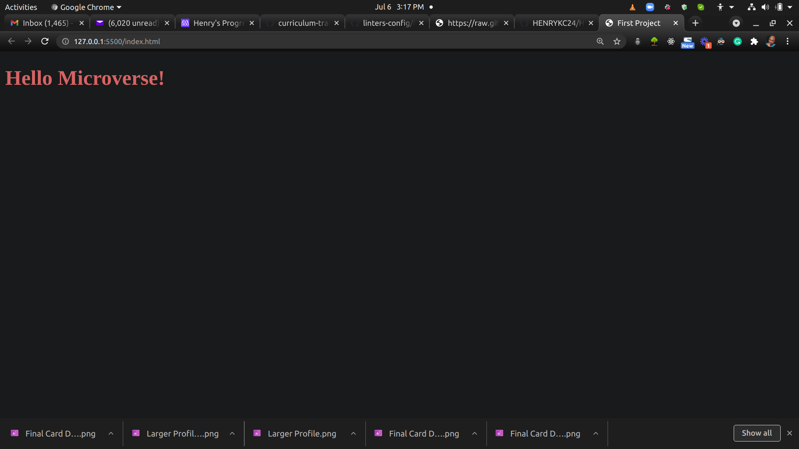

# Hello Microverse

> First Microverse Project

This is a project that test micronauts ability to use linting and git/GitHub tools in software development.

## Built With

- HTML
- CSS

## Getting Started

**This is an example of how you may give instructions on setting up your project locally.**
**Run you local server to run the app in your browser. For example, you can use visual studio code's live server to run the app**

To get a local copy up and running follow these simple example steps.

### Prerequisites

### clone the app

### Run 'npm install' from the command line

### Run 'npx hint .' to test for html linting check

### Run 'npx stylelint "**/*.{css,scss}"' to test for css linting check 

## Authors

👤 **Henry Kc**

- GitHub: [@githubhandle](https://github.com/HENRYKC24)
- Twitter: [@twitterhandle](https://twitter.com/henrykc24)
- LinkedIn: [LinkedIn](https://linkedin.com/in/henry-kc)

## 🤝 Contributing

Contributions, issues, and feature requests are welcome!

Feel free to check the [issues page](https://github.com/HENRYKC24/Hello-Microverse/issues/).

## Show your support

Give a ⭐️ if you like this project!

## Acknowledgments

- Thanks to everyone that made this project a success

## 📝 License

This project is [MIT](./LICENSE.md) licensed.
